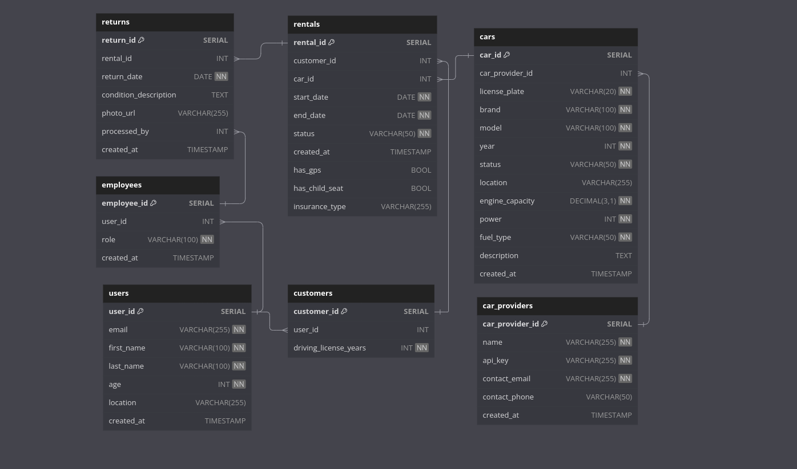

# Car Rental Database

This database is designed to support a car rental platform that acts as an intermediary between users and various car rental providers, including our own service.

## 1. Users Table
- Stores information about registered users of the platform.
- User details like email, name, age, and driving experience.
- Used for user authentication, personalization, and rental eligibility checks.

## 2. Cars Table
- Catalogues all available cars across different rental providers.
- Brand, model, year, current status, and location.
- Used to display available cars to users and track car status (available, rented, under maintenance).

## 3. Rentals Table
- All car rental transactions.
- Links users to their rented cars, including rental duration and status.
- Used to track active rentals and rental history.

## 4. Offers Table
- Pricing information for cars from our own rental service.
- Daily rates and insurance rates with validity periods.
- Used to present pricing options to users for in-house rental service.

## 5. Returns Table
- Car return process.
- Return date, car condition, and any photos taken during return.
- Links to the employee who processed the return.
- Used to manage the return workflow and maintain records for potential disputes.

## 6. Employees Table
- Stores information about our company's employees.
- Used for employee authentication and authorization in the system.

## 7. Integrators Table
- List of external car rental providers integrated with our platform.
- Stores API keys for secure communication with these providers.
- Used to manage connections with external rental services.

## 8. Integrator_Offers Table
- Similar to the Offers table, but for external rental providers.
- Stores pricing information received from integrated rental services.
- Used to present users with a comprehensive list of rental options from various providers.

## Workflows:

1. **User Registration and Authentication**:
   - New users are added to the Users table during registration.
   - User details are retrieved for authentication and profile management.

2. **Car Search and Booking**:
   - Users search for cars (querying the Cars table).
   - System fetches pricing from Offers and Integrator_Offers tables.
   - Upon booking, a new entry is created in the Rentals table.

3. **Rental Management**:
   - Active rentals are tracked in the Rentals table.
   - Car status in the Cars table is updated when rented or returned.

4. **Car Return Process**:
   - When a car is returned, an entry is created in the Returns table.
   - An employee (from Employees table) processes the return.
   - The rental status is updated in the Rentals table.

5. **Offer Management**:
   - Our own offers are managed in the Offers table.
   - External offers are stored and updated in the Integrator_Offers table.

